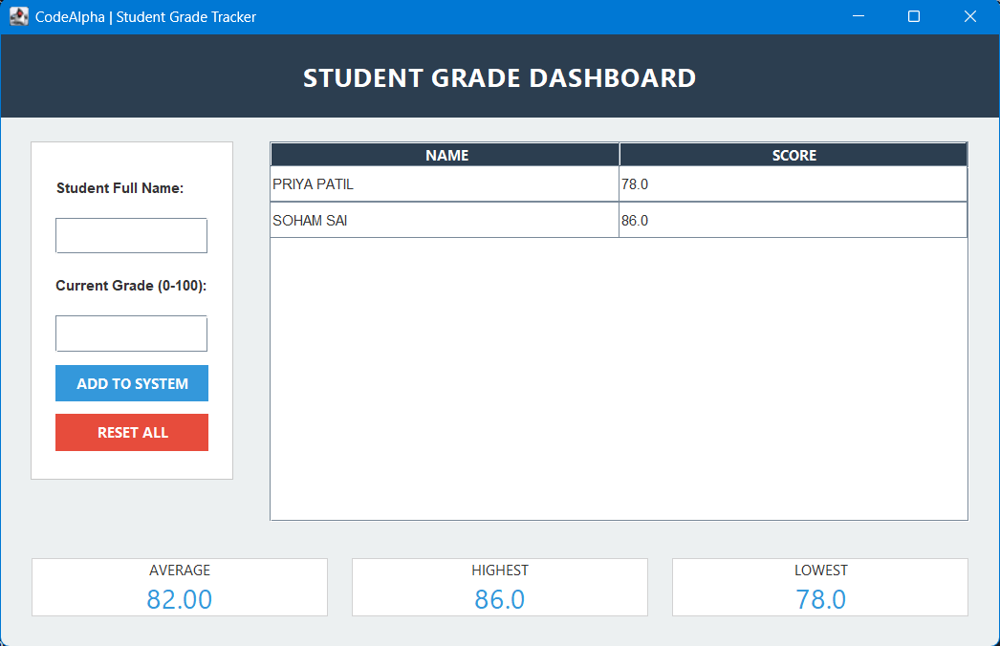

# Task1_StudentGradeTracker

## 📝 Project Overview
This is a **Student Grade Tracker** application developed as part of my **Java Programming Internship** at **CodeAlpha**. The project provides a user-friendly Graphical User Interface (GUI) to manage student records and perform statistical analysis on their academic performance.

## ✨ Features
- **Modern GUI**: Built using Java Swing with a clean, professional layout.
- **Dynamic Data Management**: Uses `ArrayList` to store an unlimited number of student records.
- **Automated Statistics**: 
  - Instantly calculates the **Class Average**.
  - Identifies the **Highest** and **Lowest** scores in the group.
- **Input Validation**: Prevents errors by ensuring names are entered and grades are within the 0-100 range.
- **Interactive Table**: Displays a real-time list of all added students.

## 🛠️ Technologies Used
- **Language**: Java 17+
- **Library**: Java Swing (GUI)
- **Concepts**: Object-Oriented Programming (OOP), Collections (ArrayList), Exception Handling.

## 🚀 How to Run
1. **Clone the Repo**: 
   ```bash
   git clone https://github.com
   ```
2. **Open in IDE**: Import the project into **Eclipse**, **IntelliJ**, or **VS Code**.
3. **Run**: Locate `StudentGradeTracker.java` inside the `src/com/codealpha/task1` package, right-click, and select **Run As > Java Application**.

## 📷 Screenshots



## 🤝 Connect with Me
- **LinkedIn**: linkedin.com/in/afifa-nayakawade
- **Internship**: @CodeAlpha
